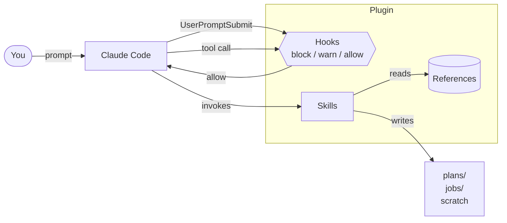

# claude-skills-public

> Quality gates and workflow skills for Claude Code, built from production use.

[](https://github.com/Damon-Stewart-1/claude-skills-public/actions/workflows/ci.yml)
[](LICENSE)


Sixteen hooks that block real mistakes (em dashes, hardcoded secrets, pushes to `main`, AI filler), twelve skills that turn long sessions into structured work (interview-style planning, dispatched background jobs, plan reviews, preflight, headless Chrome fetches, weekly and daily planning), and a small set of reference docs Claude reads during execution.

## In 30 seconds

```bash
git clone https://github.com/Damon-Stewart-1/claude-skills-public.git ~/.claude/plugins/claude-skills-public
chmod +x ~/.claude/plugins/claude-skills-public/hooks/*.sh
```

Add the plugin block to `~/.claude/settings.json` (see [Installation](#installation)), restart Claude Code, then:

```
/plan a small refactor
```

You get an interview-style planner that produces a phased markdown plan with verifiable completion promises. Open `~/.claude/plans/` to see it.

For the smallest possible setup with two hooks and one skill: see [`examples/minimal-install/`](examples/minimal-install/).

## Architecture



Hooks intercept tool calls before they happen. Skills are invoked by name with `/skill-name` and run multi-step workflows. References are markdown docs that skills load during execution.

## What's here

### Hooks

Sixteen shell scripts that hook into Claude Code's PreToolUse, PostToolUse, and UserPromptSubmit events.

| Hook | Event | What it does |
|------|-------|--------------|
| `env-guard.sh` | PreToolUse(Bash) | Blocks Bash commands that would expose secrets in shell output |
| `secrets-write-guard.sh` | PostToolUse(Write/Edit) | Detects hardcoded API keys after writes to non-`.env` files |
| `secrets-env-gate.sh` | PreToolUse(Write) | Gates writes to `.env` files, prompts for password-manager assessment |
| `no-em-dashes.sh` | PreToolUse(Write/Edit) | Blocks em dashes and en dashes in content files (the AI tell) |
| `no-ai-filler.sh` | PreToolUse(Write/Edit) | Blocks AI filler phrases ("certainly", "absolutely", etc.) |
| `no-fake-urls.sh` | PreToolUse(Write/Edit) | Warns on placeholder URLs like `example.com` in source files |
| `no-placeholders.sh` | PreToolUse(Write/Edit) | Blocks `TODO`, `PLACEHOLDER`, `YOUR_VALUE_HERE` in writes |
| `protect-main.sh` | PreToolUse(Bash) | Blocks direct pushes to `main`/`master` |
| `no-curious.sh` | PreToolUse(Bash) | Blocks exploratory commands outside the task scope |
| `figma-logo-qc.sh` | PreToolUse(Write/Edit) | Flags placeholder rectangles where real logo components belong |
| `plan-quality.sh` | PreToolUse(Write) | Checks plan files have completion promises before saving |
| `plan-gotchas-check.sh` | PreToolUse(Write) | Reminds Claude to read gotchas before writing a plan |
| `prettier-format.sh` | PostToolUse(Write/Edit) | Auto-formats JS/TS/CSS files after writes |
| `block-writes-until-review-read.sh` | PreToolUse(Write/Edit) | Blocks implementation writes until a plan review is acknowledged |
| `read-sources-before-responding.sh` | UserPromptSubmit | Detects file references in prompts; injects full file contents or a read-before-responding mandate. Mode B (triggered by "all"/"everything" or CLEAR_PREP_HANDOVER sentinel) cats file contents inline so Claude cannot skip or skim. |
| `git-pre-commit.sh` | (manual install) | Pre-commit hook that scans staged files for hardcoded secrets |

Wiring lives in `hooks/hooks.json`. Paste the matcher entries you want into your `settings.json`.

### Skills

Invokable with `/skill-name` in any Claude Code session.

| Skill | What it does |
|-------|--------------|
| `plan` | Interview-style planning. Asks targeted questions, writes a phased plan with completion promises to `~/.claude/plans/`. |
| `dispatch` | Sends a task to a background Claude process. Handles permission tiers, model selection, job IDs, output routing, and multi-LLM targets (Gemini, ChatGPT). |
| `jobs` | Lists and inspects background dispatch jobs. Shows status, exit codes, and timed-out jobs. |
| `plan-review` | Dispatches a Gemini or Opus review of a plan file. Outputs a structured critique with a risk rating. |
| `preflight` | Sanity checks before a long autonomous session: context headroom, locked files, completion criteria, iteration limit. |
| `tool-suggest` | Scans installed plugins and skills, recommends which apply to the current task. |
| `clear-prep` | Generates a self-contained session handover prompt for pasting into a cleared Claude Code instance. Includes decision log, file fingerprints, dispatch job state. |
| `chrome-headless` | Fetches rendered HTML from a public URL using Chrome headless. Lighter than Playwright, safe for dispatch. |
| `fleet-execute` | Executes READY plans from a triage queue. Shows scored-ready plans, asks confirmation, then dispatches agents. |
| `kb-ingest` | Walks through unprocessed knowledge-base raw files and ingests them one at a time. |
| `leadership-plan-daily` | Morning daily planning interview. Surfaces today's scheduled blocks and walks through time-blocking conversationally. |
| `leadership-plan-week` | Sunday weekly planning interview. Produces a WEEK_DATA JSON file with threads, day blocks, win conditions, delegations, and pushed-off items. |

### References

Markdown docs that skills read during execution.

- `gotchas.md` (planning pitfalls observed in real sessions)
- `plugin-creation.md` (correct plugin structure and manifest format)
- `ralph-usage.md` (iteration limits and safe defaults for autonomous loops)
- `security-checklist.md` (mandatory checks before commits, deploys, and middleware changes)

## Installation

### Option A: Direct plugin install (recommended)

```bash
git clone https://github.com/Damon-Stewart-1/claude-skills-public.git ~/.claude/plugins/claude-skills-public
chmod +x ~/.claude/plugins/claude-skills-public/hooks/*.sh
```

Add to `~/.claude/settings.json`:

```json
{
  "plugins": {
    "claude-skills-public": {
      "path": "~/.claude/plugins/claude-skills-public"
    }
  }
}
```

Restart Claude Code. Skills load as `/plan`, `/dispatch`, etc.

To activate hooks, copy the matcher entries from `hooks/hooks.json` into the `hooks` array of your `settings.json`. The `${CLAUDE_PLUGIN_ROOT}` variable in the command paths is set automatically by Claude Code at load time.

### Option B: Cherry-pick

Copy any hook script into your own plugin's `hooks/` directory. Copy any skill folder into `~/.claude/skills/`. Nothing has dependencies outside its own directory except `dispatch`, which requires the `scripts/dispatch.sh` script bundled with it.

## Notes

- Hook scripts must be executable: `chmod +x hooks/*.sh`
- `secrets-write-guard.sh` is intentionally PostToolUse. `.env` files are gated PreToolUse by `secrets-env-gate.sh`.
- The `plan` skill writes to `~/.claude/plans/` and reads `~/.claude/skills/plan/gotchas.md`.
- The `dispatch` skill expects the Claude Code CLI on your `PATH` as `claude` and handles Homebrew PATH initialization for background subshells.

## Requirements

- Claude Code CLI
- macOS or Linux (hooks use bash)
- `python3` (used by hooks to parse JSON stdin)
- `prettier` on `PATH` (optional, for `prettier-format.sh`)

## Examples

- [`examples/minimal-install/`](examples/minimal-install/): smallest viable setup
- [`examples/custom-hook/`](examples/custom-hook/): how to write your own hook on top of this plugin

## Security

To report a security issue, email `security@earnedimpact.org`. See [SECURITY.md](SECURITY.md).

## License

MIT. See [LICENSE](LICENSE).
